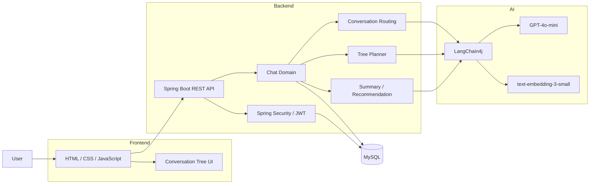
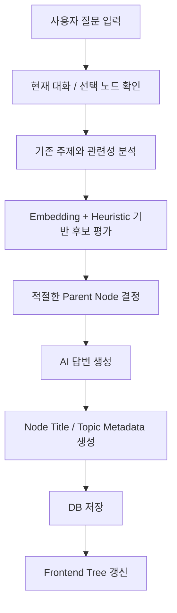

# PathLearn AI

> **Conversation Navigation Studio**
> AI 대화를 단순한 채팅 기록이 아닌 **탐색 가능한 지식 경로**로 관리하기 위한 대화형 학습 플랫폼

중앙대학교 소프트웨어학부 **2026-1 캡스톤디자인2 팀 프로젝트**입니다.

🔗 Repository
https://github.com/SeongYeonUk/CAU-AI_nevigator_system-Capston_Design_2-2026-1

---

## 1. 프로젝트 소개

ChatGPT와 같은 생성형 AI를 장시간 사용하다 보면 질문이 계속 누적되면서 다음과 같은 문제가 발생합니다.

* 이전 질문과 답변의 관계를 한눈에 파악하기 어렵다.
* 특정 주제에서 파생된 질문을 다시 찾아가기 어렵다.
* 대화가 다른 주제로 이동하면서 처음의 학습 목적을 놓치기 쉽다.
* 좋은 답변을 얻었더라도 전체 대화를 다시 읽어야 지식 흐름을 복원할 수 있다.

**PathLearn AI**는 이러한 문제를 해결하기 위해 AI와의 대화를 **부모-자식 관계를 갖는 지식 트리 형태로 구조화**합니다.

사용자는 기존 대화 노드에서 새로운 질문을 시작하고, AI가 생성한 답변을 새로운 학습 경로로 확장하며, 필요하면 노드를 이동하거나 특정 경로만 이용해 새로운 대화를 재구성할 수 있습니다.

---

## 2. 핵심 아이디어

일반적인 AI 채팅 서비스는 다음과 같이 대화를 선형적으로 저장합니다.

```text
Q1 → A1 → Q2 → A2 → Q3 → A3 → ...
```

PathLearn AI는 이를 다음과 같이 **지식 트리** 형태로 표현합니다.

```text
대주제
│
├── 소주제 A
│   ├── 질문 A-1
│   │   └── 심화 질문 A-1-1
│   └── 질문 A-2
│
├── 소주제 B
│   ├── 질문 B-1
│   └── 질문 B-2
│
└── 소주제 C
```

각 대화 노드는 다음과 같은 정보를 가질 수 있습니다.

* 부모 노드
* 트리 깊이
* 노드 제목
* Level 1 주제
* Level 2 주제
* 주제 판단을 위한 힌트
* 질문 및 AI 답변
* 생성 시각

이를 통해 단순한 채팅 기록이 아니라 **사용자의 사고 흐름과 학습 경로 자체를 저장**하는 것을 목표로 했습니다.

---

## 3. 주요 기능

### 3.1 AI 대화

OpenAI 기반 LLM을 활용하여 사용자의 질문에 응답합니다.

* GPT 기반 질문·답변
* 기존 대화 문맥 활용
* 대화별 채팅방 관리
* 과거 대화 기록 조회

---

### 3.2 대화 트리 자동 생성

사용자의 질문을 분석하여 기존 대화 트리에서 적절한 위치를 탐색하고 새로운 노드를 생성합니다.

노드에는 다음과 같은 메타데이터가 저장됩니다.

```text
nodeTitle
level1Topic
level2Topic
topicHints
depth
parent
```

이를 이용해 같은 주제의 질문들을 구조적으로 관리할 수 있습니다.

---

### 3.3 의미 기반 노드 라우팅

질문이 기존 트리의 어느 위치와 가장 관련이 있는지 판단하기 위해 다음 요소들을 함께 활용합니다.

* OpenAI Embedding
* Cosine Similarity
* 주제별 키워드 및 힌트
* Token Overlap
* 기존 Branch Context
* Rule / Heuristic 기반 점수

단순 키워드 일치만 사용하는 대신 **임베딩 기반 의미 유사도와 휴리스틱 점수를 함께 사용**하도록 구성했습니다.

임베딩 API 호출에 문제가 발생하는 경우에도 키워드 기반 휴리스틱 점수로 판단할 수 있도록 fallback 로직을 적용했습니다.

---

### 3.4 AI 기반 노드 제목 생성

긴 질문을 그대로 트리에 표시하는 대신 LLM을 이용해 짧은 노드 제목을 생성합니다.

예시:

```text
사용자 질문
"운영체제에서 데드락이 발생하는 네 가지 조건을 알려줘"

↓

트리 노드
"데드락 발생 조건"
```

Level 1 / Level 2 주제와 현재 질문을 함께 활용해 트리에서 이해하기 쉬운 제목을 생성합니다.

---

### 3.5 루트 주제 이탈 감지

현재 질문이 처음 설정한 학습 주제와 얼마나 관련되어 있는지 확인하여 사용자가 학습 경로에서 크게 벗어나는 상황을 감지합니다.

사용자는 새로운 질문이 기존 학습 경로의 연장인지, 새로운 주제로 분리할 필요가 있는지 판단할 수 있습니다.

---

### 3.6 과거 노드에서 대화 분기

사용자는 가장 최근 대화뿐 아니라 **과거에 생성된 특정 노드에서 새로운 질문을 시작**할 수 있습니다.

예시:

```text
자료구조
├── 선형 자료구조
│   ├── Stack
│   └── Queue
│
└── 비선형 자료구조
    ├── Tree
    └── Graph
```

현재 `Graph`를 학습하고 있더라도 과거 `Stack` 노드로 돌아가 새로운 심화 질문을 시작할 수 있습니다.

---

### 3.7 트리 노드 이동 및 재배치

AI가 자동으로 생성한 구조가 사용자의 의도와 다를 경우 직접 수정할 수 있습니다.

* 노드 이동
* 부모 노드 변경
* 노드 강제 배치
* 노드 제목 수정
* 선택 노드와 하위 Subtree 삭제

이를 통해 AI가 생성한 구조를 사용자가 직접 보정할 수 있습니다.

---

### 3.8 트리 목록형 / 그래프형 시각화

대화 구조를 두 가지 방식으로 탐색할 수 있습니다.

#### 목록형

계층 구조를 빠르게 확인하는 데 적합합니다.

#### 그래프형

대화 전체의 분기 구조와 현재 위치를 시각적으로 확인할 수 있습니다.

그래프 화면에서는 다음 기능을 제공합니다.

* 확대 / 축소
* 표시 범위 조절
* 노드 선택
* 노드 형태 변경
* 선택 노드 중심 탐색

---

### 3.9 노드 검색

대화가 길어질 경우 원하는 내용을 빠르게 찾을 수 있도록 노드 검색 기능을 제공합니다.

검색 대상:

* 전체
* 질문
* 답변

---

### 3.10 선택 Q&A 요약

특정 노드를 선택하면 해당 질문과 답변을 LLM이 핵심 키워드와 짧은 설명으로 요약합니다.

이를 통해 긴 답변을 다시 읽지 않고도 핵심 내용을 빠르게 확인할 수 있습니다.

---

### 3.11 하위 노드 추천

선택한 학습 주제를 기준으로 AI가 다음에 학습하면 좋은 **직접 하위 주제**를 추천합니다.

예시:

```text
운영체제
└── 프로세스
    ├── PCB
    ├── Context Switching
    └── Process State
```

추천된 항목을 선택하면 해당 주제의 새로운 대화 노드를 생성할 수 있습니다.

---

### 3.12 경로 기반 새 대화 재구성

기존 트리 전체를 복사하는 대신 사용자가 선택한 **특정 학습 경로와 가지들만 이용하여 새로운 대화를 구성**할 수 있습니다.

이를 통해 여러 방향으로 확장된 대화 중 필요한 지식만 골라 별도의 학습 흐름으로 다시 구성할 수 있습니다.

---

### 3.13 경로 지식 추출

선택된 대화 경로에서 핵심 지식을 추출하여 **학습 리포트 형태**로 제공합니다.

사용자는 추출된 내용을 확인하고 복사하여 별도의 학습 자료로 활용할 수 있습니다.

---

### 3.14 사용자 인증 및 계정 관리

JWT 기반 인증을 적용했습니다.

지원 기능:

* 회원가입
* 로그인
* JWT 인증
* 프로필 조회
* 닉네임 및 비밀번호 변경
* 회원 탈퇴

---

## 4. System Architecture



---

## 5. 대화 처리 흐름

개념적인 처리 흐름은 다음과 같습니다.



---

## 6. Tech Stack

### Backend

| Category       | Technology                    |
| -------------- | ----------------------------- |
| Language       | Java 17                       |
| Framework      | Spring Boot 3.4.2             |
| Web            | Spring Web                    |
| ORM            | Spring Data JPA               |
| Security       | Spring Security               |
| Authentication | JWT                           |
| Database       | MySQL                         |
| AI Framework   | LangChain4j                   |
| LLM            | OpenAI GPT-4o-mini            |
| Embedding      | OpenAI text-embedding-3-small |
| Test           | JUnit / Spring Boot Test      |
| Build          | Gradle                        |

### Frontend

| Category           | Technology         |
| ------------------ | ------------------ |
| Markup             | HTML5              |
| Style              | CSS3               |
| Language           | Vanilla JavaScript |
| API                | Fetch API          |
| Markdown Rendering | marked.js          |

---

## 7. 주요 Backend 구조

```text
backend/
└── src/main/java/com/rabbit
    ├── domain
    │   ├── chat
    │   │   ├── controller
    │   │   ├── dto
    │   │   ├── entity
    │   │   ├── Repository
    │   │   └── service
    │   │
    │   └── user
    │       ├── controller
    │       ├── dto
    │       ├── entity
    │       ├── repository
    │       └── service
    │
    └── global
        ├── config
        └── security
```

### 주요 Chat Service

```text
ChatService
├── 전체 대화 흐름 관리
├── 질문 처리
├── 채팅방 관리
├── 트리 노드 생성 / 이동 / 삭제
├── 부모 노드 결정
├── 대화 재구성
└── 지식 추출

ContextSimilarityService
├── Embedding Similarity
├── Cosine Similarity
├── Heuristic Matching
├── Topic Hint Matching
└── Fallback 처리

ConversationTreePlannerService
├── Level 1 Topic 결정
├── Level 2 Topic 결정
├── Node Title 생성
└── Tree Metadata 생성

ConversationTreeAiService
├── Node Label 생성
├── Subtopic 분류
├── Topic Hint 생성
├── 선택 Q&A 요약
└── 하위 Topic 추천
```

---

## 8. 주요 API

### Authentication

| Method | Endpoint            | Description |
| ------ | ------------------- | ----------- |
| POST   | `/api/auth/signup`  | 회원가입        |
| POST   | `/api/auth/login`   | 로그인         |
| GET    | `/api/auth/profile` | 프로필 조회      |
| PUT    | `/api/auth/profile` | 프로필 수정      |
| DELETE | `/api/auth/account` | 회원 탈퇴       |

### Chat Room

| Method | Endpoint                        | Description |
| ------ | ------------------------------- | ----------- |
| GET    | `/api/chat/rooms`               | 채팅방 목록      |
| POST   | `/api/chat/room`                | 채팅방 생성      |
| DELETE | `/api/chat/room/{roomId}`       | 채팅방 삭제      |
| PUT    | `/api/chat/room/{roomId}/title` | 채팅방 제목 변경   |

### Conversation

| Method | Endpoint                                   | Description  |
| ------ | ------------------------------------------ | ------------ |
| POST   | `/api/chat`                                | AI 질문        |
| GET    | `/api/chat/room/{roomId}/history`          | 대화 기록 조회     |
| GET    | `/api/chat/room/{roomId}/tree`             | 대화 트리 조회     |
| POST   | `/api/chat/room/{roomId}/root-topic-check` | 루트 주제 관련성 확인 |

### Tree

| Method | Endpoint                                                      | Description   |
| ------ | ------------------------------------------------------------- | ------------- |
| GET    | `/api/chat/node/{nodeId}/insight`                             | 선택 노드 인사이트    |
| GET    | `/api/chat/room/{roomId}/node/{nodeId}/child-recommendations` | 하위 주제 추천      |
| POST   | `/api/chat/room/{roomId}/node/{nodeId}/recommended-child`     | 추천 하위 노드 생성   |
| DELETE | `/api/chat/room/{roomId}/node/{nodeId}`                       | 노드 및 하위 트리 삭제 |
| PUT    | `/api/chat/room/{roomId}/node/{nodeId}/move`                  | 노드 이동         |
| PUT    | `/api/chat/room/{roomId}/node/{nodeId}/force-placement`       | 노드 강제 재배치     |

### Knowledge Path

| Method | Endpoint                 | Description      |
| ------ | ------------------------ | ---------------- |
| POST   | `/api/chat/room/rebuild` | 선택 경로 기반 새 대화 생성 |
| POST   | `/api/chat/room/extract` | 선택 경로 지식 추출      |

---

## 9. 테스트

대화 트리의 핵심 기능인 **질문 라우팅 정확도**를 확인하기 위한 시나리오 기반 테스트 코드를 작성했습니다.

예를 들어 다음과 같은 상황을 테스트합니다.

```text
컴퓨터공학
├── 운영체제
└── 자료구조
    ├── 선형 자료구조
    └── 비선형 자료구조
```

사용자가 현재 선형 자료구조 노드에 있더라도

```text
"트리 구조의 정의는 뭐야?"
```

와 같은 질문을 하면 단순히 현재 노드의 자식으로 연결하는 것이 아니라 의미적으로 적절한 **비선형 자료구조 Branch**를 탐색하도록 테스트 시나리오를 구성했습니다.

또한

* Deadlock → 발생 조건 → 은행원 알고리즘
* 선형 자료구조 ↔ 비선형 자료구조
* Tree / Graph / Weighted Graph
* Linked List

등 여러 Branch 이동 상황을 테스트 대상으로 구성했습니다.

---

## 10. 실행 방법

### Backend

```bash
cd backend
```

OpenAI API Key를 환경변수로 설정합니다.

#### macOS / Linux

```bash
export OPENAI_API_KEY="YOUR_OPENAI_API_KEY"
```

#### Windows PowerShell

```powershell
$env:OPENAI_API_KEY="YOUR_OPENAI_API_KEY"
```

MySQL을 실행하고 `application.yml`의 데이터베이스 접속 정보를 자신의 로컬 환경에 맞게 설정합니다.

이후 Spring Boot 서버를 실행합니다.

#### macOS / Linux

```bash
./gradlew bootRun
```

#### Windows

```powershell
gradlew.bat bootRun
```

---

### Frontend

별도의 JavaScript Framework 없이 정적 HTML / CSS / JavaScript로 구성되어 있습니다.

예를 들어 VS Code Live Server를 이용하거나 다음과 같이 간단한 HTTP Server를 사용할 수 있습니다.

```bash
cd frontend
python -m http.server 5500
```

브라우저에서 다음 주소로 접속합니다.

```text
http://localhost:5500
```

---

## 11. Project Structure

```text
CAU-AI_nevigator_system-Capston_Design_2-2026-1/
│
├── backend/
│   ├── src/main/java/com/rabbit/
│   │   ├── domain/
│   │   │   ├── chat/
│   │   │   └── user/
│   │   └── global/
│   │       ├── config/
│   │       └── security/
│   │
│   ├── src/main/resources/
│   ├── src/test/
│   └── build.gradle
│
├── frontend/
│   ├── index.html
│   ├── styles.css
│   ├── app.js
│   └── js/
│       ├── api/
│       ├── state/
│       ├── config.js
│       └── main.js
│
└── db/
    └── DBbackup.sql
```

---

## 12. AI-Assisted Development

본 프로젝트는 생성형 AI 코딩 도구를 적극적으로 활용하여 개발했습니다.

팀에서는 단순히 AI가 생성한 코드를 사용하는 것보다 다음 과정에 중점을 두었습니다.

1. 해결하려는 문제 정의
2. 핵심 기능 및 사용자 시나리오 논의
3. 대화 트리 구조와 동작 규칙 설계
4. 기능별 요구사항을 구체적인 형태로 AI에 전달
5. 생성된 코드와 동작 결과 확인
6. 오류 및 요구사항 불일치 부분 수정
7. Frontend / Backend / AI 기능 통합
8. 실제 대화 시나리오를 이용한 반복 검증

이를 통해 생성형 AI를 **개발자를 대체하는 도구가 아니라, 정의된 요구사항을 빠르게 구현하고 반복적으로 실험하기 위한 개발 도구**로 활용하는 경험을 얻었습니다.

---

## 13. 프로젝트에서 배운 점

### AI 기능도 명확한 요구사항이 필요하다

LLM을 연결하는 것만으로 원하는 서비스가 완성되는 것이 아니라, 어떤 경우에 기존 Branch를 선택하고 언제 새로운 Branch를 만들어야 하는지와 같은 구체적인 규칙이 필요했습니다.

### 자연어의 의미는 단순 키워드만으로 판단하기 어렵다

사용자의 표현이 달라질 수 있기 때문에 Embedding 기반 의미 유사도와 키워드 기반 판단을 함께 활용하는 방식이 필요했습니다.

### AI의 판단을 사용자가 수정할 수 있어야 한다

AI가 항상 올바른 트리 위치를 선택할 수는 없기 때문에 Node Move, Force Placement와 같이 사용자가 직접 결과를 보정할 수 있는 기능을 추가했습니다.

### 생성형 AI 시대에는 구현 이전의 설계가 더욱 중요하다

코드 생성 속도가 빨라질수록 무엇을 만들 것인지, 어떤 예외 상황을 처리할 것인지, 각 기능이 어떻게 연결될 것인지를 명확하게 정의하는 능력이 중요하다는 점을 경험했습니다.

---

## 14. 향후 개선 방향

* AI Routing 정확도 정량 평가
* Embedding 호출 결과 Cache 적용
* 대화량 증가에 따른 Tree 탐색 최적화
* Prompt 및 Routing Logic 모듈화
* Frontend 코드 구조 개선
* 실시간 Streaming Response 적용
* Test Coverage 확대
* Docker 기반 실행 환경 구축
* Database Migration 도구 적용
* 운영 환경 Secret 관리
* CI/CD 구축

---

## 15. Security Notice

현재 개발용 설정 파일에는 로컬 개발 환경에서 사용하던 설정이 포함될 수 있습니다.

공개 저장소 또는 실제 운영 환경에서 사용할 경우 반드시 다음 항목을 환경변수 또는 Secret Manager를 통해 관리해야 합니다.

```text
OPENAI_API_KEY
DB_USERNAME
DB_PASSWORD
JWT_SECRET
```

이미 공개 저장소에 포함된 Credential이 있다면 **기존 값을 폐기하고 새로운 값으로 교체한 후**, Git History에서도 제거하는 것을 권장합니다.

---

## 16. 개발 형태

* 중앙대학교 소프트웨어학부
* 2026학년도 1학기
* 캡스톤디자인2
* Team Project
* Generative AI Assisted Development
